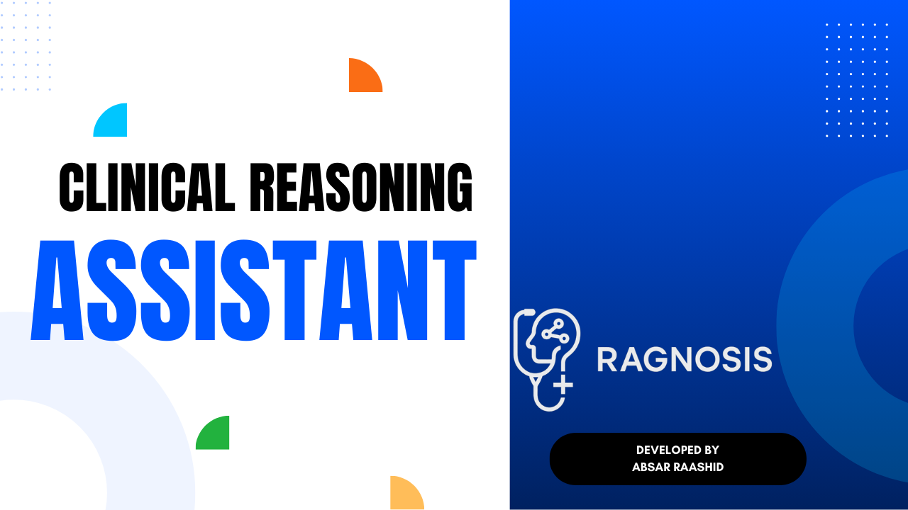
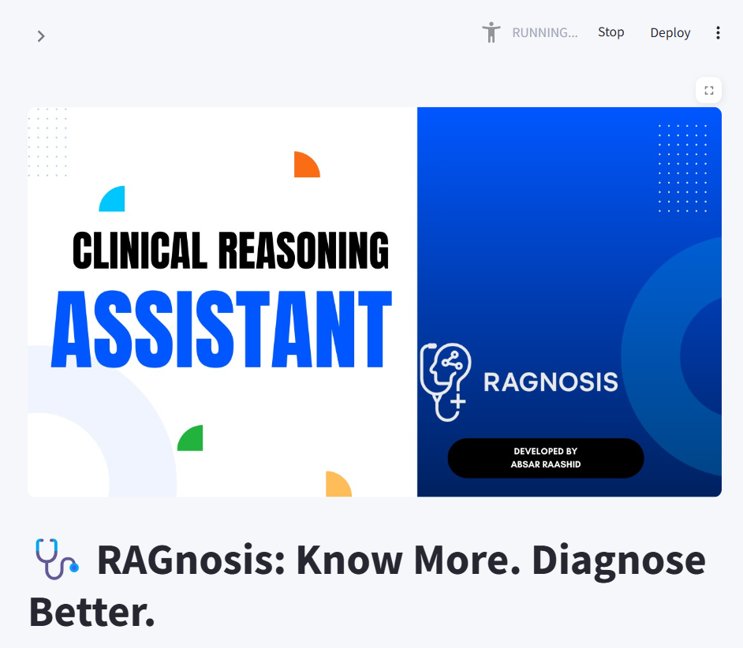
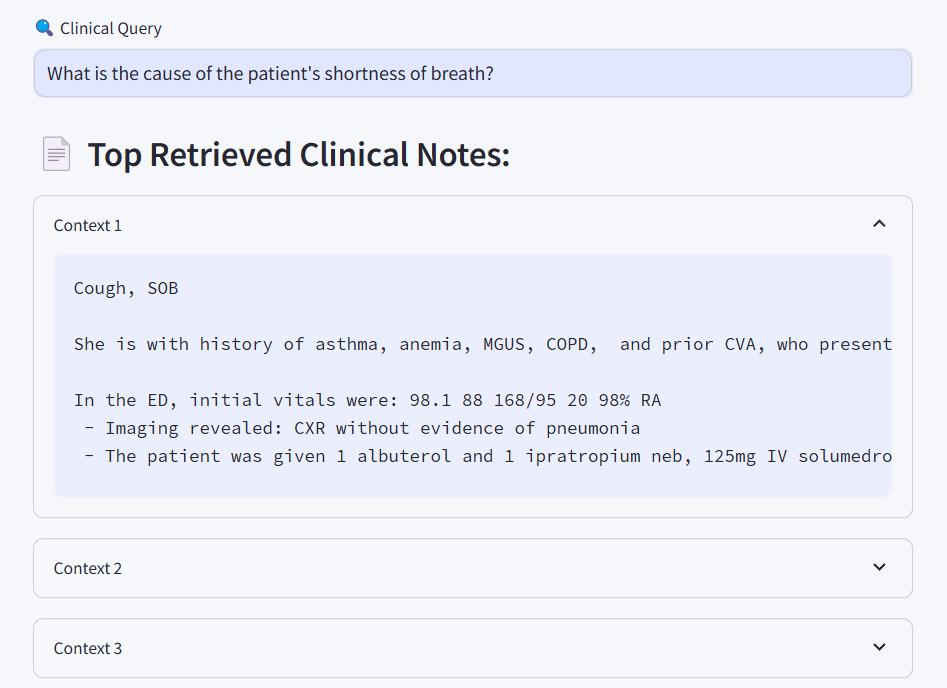
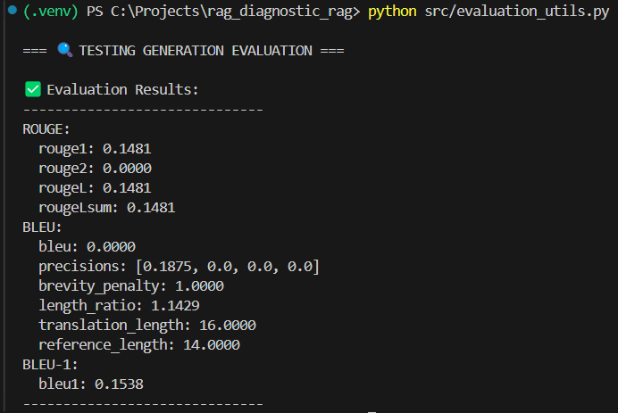

# 🧠 RAGnosis – Clinical Reasoning Assistant

An AI-powered assistant for diagnostic reasoning using **Retrieval-Augmented Generation (RAG)** on annotated patient notes from the [MIMIC-IV-Ext DiReCT](https://github.com/wbw520/DiReCT) dataset.

Built with ❤️ using `Streamlit`, `SentenceTransformers`, `FAISS`, and `Transformers`.

---



---

## 🩺 Overview

**RAGnosis** combines dense retrieval and large language models to answer clinical questions using real-world diagnostic notes. It retrieves relevant clinical cases and generates AI-assisted diagnostic suggestions using context.

---

## 🚀 Features

- 🔍 Dense Retrieval of similar patient cases (FAISS + MiniLM)
- 💬 Context-aware Diagnosis Generation (LLMs)
- 📊 ROUGE, BLEU, and BLEU-1 evaluation support
- 🧠 Real-time clinical query interface via Streamlit
- 🧪 Optimized for GPU acceleration using CUDA
- 💅 Beautiful UI with custom styling

---

## 📸 Demo

<p align="center">
  
</p>

---


## 📸 Output

<p align="center">
  
</p>

---

## 🗃️ Dataset Structure

```bash
data/
├── diagnosis_flowchart/      # Diagnostic KG for each disease
├── finished_cases/           # Annotated notes (JSON)
├── clinical_embeddings.pkl   # Precomputed note embeddings
```

## 🛠️ Installation
```
git clone https://github.com/AbsarRaashid3/RAGnosis.git
cd RAGnosis

# Optional: create a virtual environment
python -m venv .venv
.venv/Scripts/activate

# Install dependencies
pip install -r requirements.txt
```

⚙️ Usage
🔹 1. Preprocess Clinical Notes
```
python src/preprocessing.py
```
🔹 2. Run the Streamlit Frontend
```
streamlit run app.py
```
**Then go to http://localhost:8501**

## 🧪 Evaluation
You can test generation quality using:
```
python src/evaluation_utils.py
```
---

## 📸 evaluation_utils

<p align="center">
  
</p>

---

### Includes:
- ROUGE
- BLEU (standard)
- BLEU-1 (unigram precision)

## 📁 Project Structure
```
RAGnosis/
├── app.py                   # Streamlit frontend
├── src/
│   ├── preprocessing.py     # Embedding + data prep
│   ├── retriever.py         # FAISS-based retriever
│   ├── generator.py         # LLM-based generator
│   └── evaluation_utils.py  # Evaluation metrics
├── assets/                  # Banner / UI assets
└── .streamlit/config.toml   # Custom Streamlit theme
```

## 💻 Technologies Used
- SentenceTransformers
- Transformers (HuggingFace)
- FAISS
- Streamlit
- Evaluate (HuggingFace)

## 📌 Example Clinical Queries
**"Does the patient have COPD?"** <br>
**"Can this be diagnosed as a duodenal ulcer?"** <br>
**"Is shortness of breath explained by heart failure?"** <br>
**"Should this patient undergo endoscopy?"** <br><br>


**Created by Muhammad Absar Raashid**
